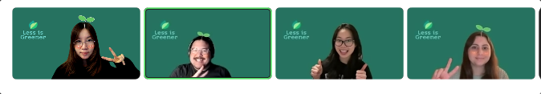
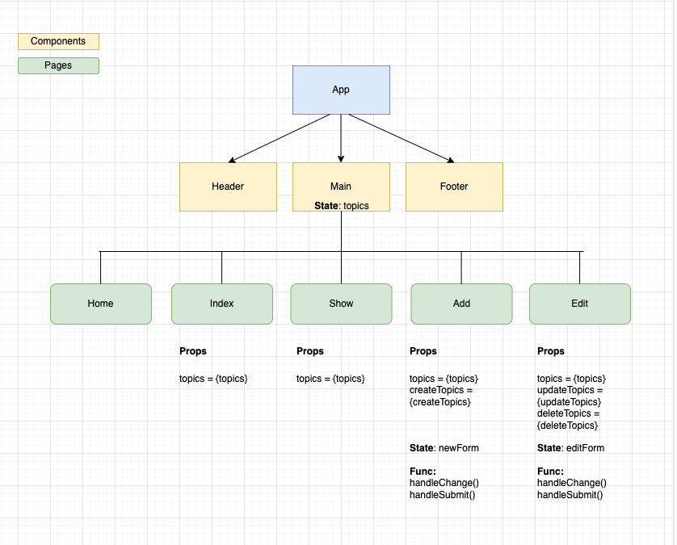
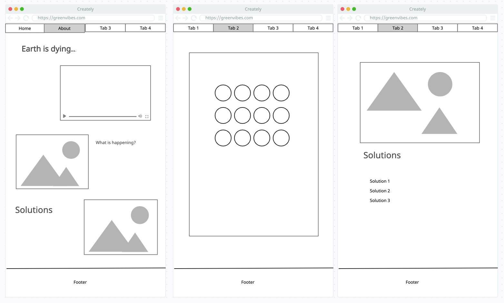
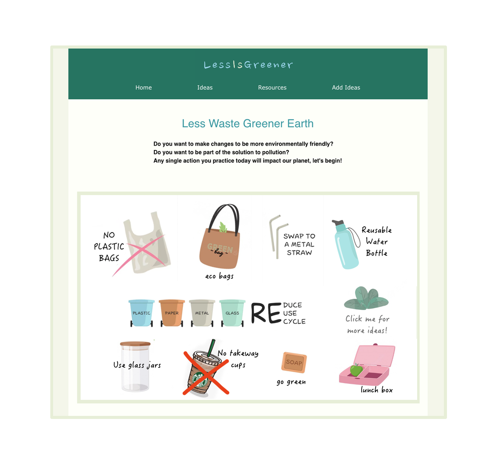
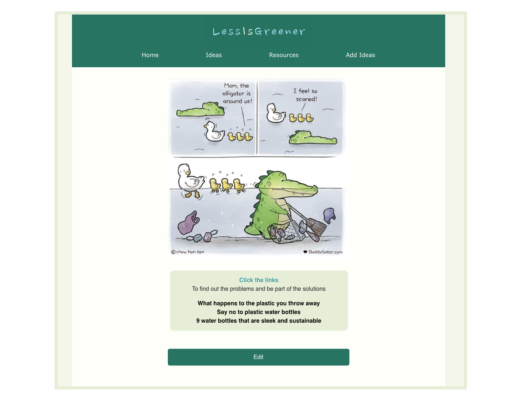

# LessIsGreener

LessIsGreener is a app to provide a user environmental, sustainability, and eco-friendly solutions to keep our Earth greener. 

## Team 

* Product Manager: Cynthia Alanis
* Repo Owner: An Bui
* Frontend Lead: Jieun Pivarnik
* Backend Lead: Matthew Subin 

## Repo

#### Backend: [https://github.com/anbee123/Less-is-Greener-backend](https://github.com/anbee123/Less-is-Greener-backend)
#### Frontend: [https://github.com/anbee123/Less-is-Greener-frontend](https://github.com/anbee123/Less-is-Greener-frontend)

## Frontend Diagram

## Wireframe 

## Interface

### Technologies Used

* Express
* React
* MongoDB/Mongoose
* Node
* Full CRUD

## Live link

[https://app.netlify.com/sites/less-is-greener/overview](https://app.netlify.com/sites/less-is-greener/overview)

## Future Enhancement 

* Include admin features with ability to log in and out
* Add search functionality to find item/topic 
* Add sort button to sort items in alphabetical order

